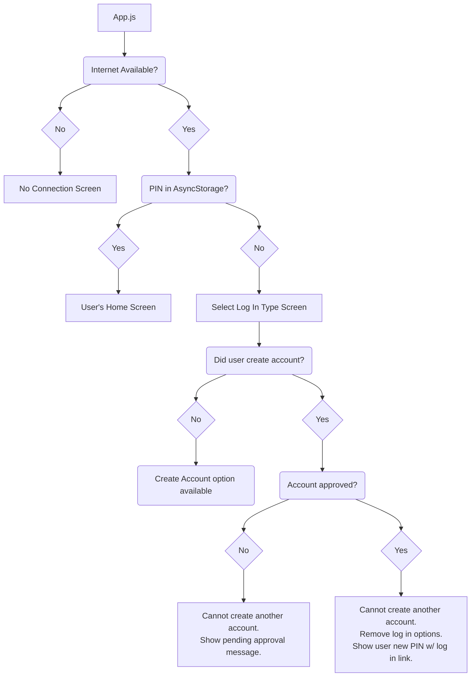

# eeds Mobile App

## Introduction

The eeds mobile app allows eeds healthcare professional users to create an eeds account and document their CE credits using their iOS or Android mobile device.

The app is built using Expo.

> Expo is a framework and a platform for universal React applications. It is a set of tools and services built around React Native and native platforms that help you develop, build, deploy, and quickly iterate on iOS, Android, and web apps from the same JavaScript/TypeScript codebase.

The current version of the app is using Expo SDK 38, which ships with React Native 0.62.

Expo and React Native both have excellent documentation, which can be found at the following locations:

- [Expo Documentation](https://docs.expo.io/)
- [React Native Documentation](https://reactnative.dev/docs/0.62/getting-started)

## Features

The eeds mobile appilication is targeted at healthcare professionals rather than education sponsors. The following table documents what healthcare professionals can do in the app, and indicates whether the action is performed natively (i.e., using only native application screens) or through the eeds mobile site, which is loaded inside a WebView within the app.

| Feature                        | Native | WebView |
| ------------------------------ | :----: | :-----: |
| Create an account              |   ✔    |         |
| Sign in to an event            |   ✔    |         |
| View current events            |        |    ✔    |
| Enter self-declared activities |        |    ✔    |
| Take evaluation surveys        |        |    ✔    |
| View attendance reports        |        |    ✔    |
| View CE calendar               |        |    ✔    |
| Access course materials        |        |    ✔    |
| Register for symposia          |        |    ✔    |

## Getting Started

Development requires the Expo command-line interface (CLI) and Expo mobile client. The former should be installed on your development machine while the latter should be installed on your iOS or Android device. You can find instructions for installing both the CLI and the mobile client on [this page of the React Native documentation](https://reactnative.dev/docs/0.62/environment-setup) (be sure to follow the instructions under the "Expo CLI Quickstart" tab, **not** the "React Native CLI Quickstart" tab). You may also refer to [this page](https://docs.expo.io/get-started/installation/) of the Expo documentation.

> While not a requirement, using a Node version manager can prevent issues that sometimes arise in connection with globally installed npm packages (e.g., insufficient security permissions). For Windows, use [nvm-windows](https://github.com/coreybutler/nvm-windows) and for macOS, use [nvm](https://github.com/nvm-sh/nvm).

One of the nicest features of React Native is the ability to use npm packages. Note, however, that not all npm packages that work with bare React Native packages work with Expo-managed React Native projects. For that reason, when installing npm packages, use the command `expo install [package-name]` rather than `npm install [package name]` to ensure that an Expo-compatible version of the package is installed.

[ESLint](https://eslint.org/) and [Prettier](https://prettier.io/) are also highly recommend to avoid syntax erros and ensure consistency in code style.

## Publishing and Distributing

Instructions for publishing and distributing the app to the App Store and Play Store can be found on [this page of the Expo documentation](https://docs.expo.io/workflow/publishing/).

## File Structure

While not exhaustive, what follows is a brief explanation of the kind of code found in each root-level folder of the application code.

### Root

**App.js**

The root directory contains the apps entry file, `App.js`, which is responsible for checking for the presense of Internet connection, wrapping the app in the required context providers, and loading the relevant navigator based on the user's authentication status.

The flow for bootstrapping the application (and thus determining what is displayed when the user opens the app) is as follows:

**app.json**

The `app.json` file is used to define the [Expo configuration](https://docs.expo.io/workflow/configuration/) for the app and is where things like the icon, splash screen, and OS-specific options are set.

### Assets

Contains images used within the app, the app's icon, and the splash screen that is displayed with the OS is loading the app (the paths to the icon and splash screen are defined in `app.json`).

### Components

Contains React components that are used within the app. Components are units of the UI that could in theory be used on multiple screens. This way, it isn't necessary to shove all of the code for the UI into the files for each screen, which makes for cleaner code.

The tradeoff is that related code isn't always in the same place (e.g., the HomeMenuTouchableItem component isn't in the same place as the HomeScreen screen). Thus, in some cases, a single file defines multiple components (e.g. CustomPicker.js) since those components are very tightly coupled.

The point at which it makes sense to convert a bit of UI code into a dedicated component is not always clear, so this is an area that needs to be constantly monitored and reevaluated to ensure the code is approachable. For more on this, see [this post by Kent C. Dodds](https://kentcdodds.com/blog/when-to-break-up-a-component-into-multiple-components).

### Context

In React, context provides a way to pass data down a "tree" of components without having to manually pass props at every level. For example, the user's PIN is first retrieved in `auth/LogInScreen.js` but we also need to the PIN in several screens after the user logs in. Rather than having to manually pass the PIN to every component that needs it, its value can be set in the `auth-context.js` file, and then whenever it's needed somewhere else, it can be retrieved from the Context provider. For more on how React Context works, see [this page of the documentation](https://reactjs.org/docs/context.html).

**A Special Note on `auth-context.js`**

The `auth-context.js` file is probably the most complicated file in the whole app. It's responsible for all of the following:

- Trying to restore the user's PIN when the app is opened.
- Managing the user's current authentication state (i.e., whether they are logged in or logged out).
- Providing methods to log the user in or out.
- Providing the method the create a new account.
- Checking whether the user has an account pending approval whenever the app transitions from an inactive state to an active state.
- Retrieving and setting the value of the user's PIN if/when their pending account is approved.

Not all of the logic to handle these actions is contained within the `auth-context.js` file itself (e.g., the code that makes the HTTP request to create a new user account), but it is responsible for "directing" all of those actions.

This file would likely benefit from revision in a future release, but given how tightly coupled the code is, it will require extensive testing.

### Navigation

The app uses the popular [React Navigation](https://reactnavigation.org/) package to handle moving between screens. There are two navigators. `AppNavigator.js` defines the screen stack that is available to authenticated users, while `AuthNavigator.js` defines the screen stack that is available to unauthenticated users.

The navigator that the app uses is determined by value of `pin` in `auth-context.js`. If `pin` is `null`, the app uses `AuthNavigator.js`, while if `pin` has a value, the app uses `AppNavigator.js`.

Because `pin` is in the context provider defined in `auth-context.js`, whenever the value of `pin` changes, the active navigator changes accordingly.

The logic to determine which navigator is used is in the main `App.js` file.

### Screens

React Native applications are built around screens (similar to the way websites are built around pages). The `screens` folder contains all of the screens used in app. Screens in the `auth` subfolder are used when the user is not authenticated and pertain to signing in and creating an account. These screens are associated with the `AuthNavigtor.js` navigation component.

Screens in the root folder are available to users who are authenticated and are associated with the `AppNavigator.js` navigation component.

### Utils

Files in `utils` folder contain JavaScript code that doesn't define React components but is used strictly for various bits of business logic (e.g., checking the time of day, associating icons with menu items). These bits of code are extracted into their own files for easier reuse and to help clean up the files in which the code is used.
